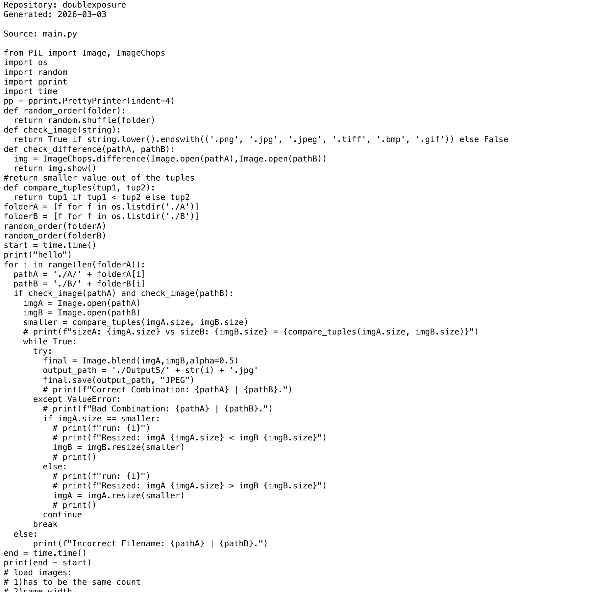

# Project Narrative & Proof

Generated: 2026-03-03

## User Journey
1. Discover the project value in the repository overview and launch instructions.
2. Run or open the build artifact for doublexposure and interact with the primary experience.
3. Observe output/behavior through the documented flow and visual/code evidence below.
4. Reuse or extend the project by following the repository structure and stack notes.

## Design Methodology
- Iterative implementation with working increments preserved in Git history.
- Show-don't-tell documentation style: direct assets and source excerpts instead of abstract claims.
- Traceability from concept to implementation through concrete files and modules.

## Progress
- Latest commit: 5cc4d48 (2026-03-02) - docs: add professional README with badges
- Total commits: 2
- Current status: repository has baseline narrative + proof documentation and CI doc validation.

## Tech Stack
- Detected stack: GitHub Actions, Python

## Main Key Concepts
- Source-driven architecture captured directly in repository files.

## What I'm Bringing to the Table
- End-to-end ownership: from concept framing to implementation and quality gates.
- Engineering rigor: repeatable workflows, versioned progress, and implementation-first evidence.
- Product clarity: user-centered framing with explicit journey and value articulation.

## Show Don't Tell: Screenshots


## Show Don't Tell: Code Excerpt
Source: `main.py`

```py
from PIL import Image, ImageChops
import os
import random
import pprint
import time
pp = pprint.PrettyPrinter(indent=4)
def random_order(folder):
  return random.shuffle(folder)
def check_image(string):
  return True if string.lower().endswith(('.png', '.jpg', '.jpeg', '.tiff', '.bmp', '.gif')) else False
def check_difference(pathA, pathB):
  img = ImageChops.difference(Image.open(pathA),Image.open(pathB))
  return img.show()
#return smaller value out of the tuples
def compare_tuples(tup1, tup2):
  return tup1 if tup1 < tup2 else tup2
folderA = [f for f in os.listdir('./A')]
folderB = [f for f in os.listdir('./B')]
random_order(folderA)
random_order(folderB)
start = time.time()
print("hello")
for i in range(len(folderA)):
  pathA = './A/' + folderA[i]
  pathB = './B/' + folderB[i]
  if check_image(pathA) and check_image(pathB):
    imgA = Image.open(pathA)
    imgB = Image.open(pathB)
    smaller = compare_tuples(imgA.size, imgB.size)
    # print(f"sizeA: {imgA.size} vs sizeB: {imgB.size} = {compare_tuples(imgA.size, imgB.size)}")
    while True:
      try:
        final = Image.blend(imgA,imgB,alpha=0.5)
        output_path = './Output5/' + str(i) + '.jpg'
        final.save(output_path, "JPEG")
```
